# Banana Palace
TODO: Add logo image

Link to live website: [Banana Palace](TODO)  (*Hold Ctrl (or Cmd) and click to open in a new window.*)

## Table of contents

TODO

* [Introduction](#introduction)
    * [Website goals](#website-goals)
    * [First time user goals](#first-time-user-goals)
    * [Returning user goals](#returning-user-goals)
* [Design](#design)
    * [Colours](#colours)
* [Features](#features)
    * [Welcome screen](#welcome-screen)
* [Future features](#future-features)
* [Technologies used](#technologies-used)
    * [Languages](#languages)
* [Testing](#testing)
* [Deployment](#deployment)
    * [Heroku](#deployment-to-heroku)
    * [Changes](#changes-to-the-code)
    * [Local development](#local-development)
        * [Forking](#forking-the-project)
        * [Cloning](#cloning-the-project)
* [Credits](#credits)
    * [Content](#content)
    * [Media](#media)
    * [Code](#code)

## Introduction

This website is ... for ...

### Website goals
- Help

### First time user goals
- Think about

### Returning user goals
-

# UX and UI - (user experience and user interface)

### Mobile first approach
All pages are designed to be responsive to different screen sizes to accommodate users with different preferred devices.

Screenshot examples of responsive behavior from mobile to tablet to computer
 

 

### Accessibility

Semantic HTML is used to aid people with dissabilities such as visual impairment and alternative text is used for all images so it can be read by screen readers. Semantic HTML also helps with search engine optimization so the right users can find this site and find it useful.

## Design

### Colours

 
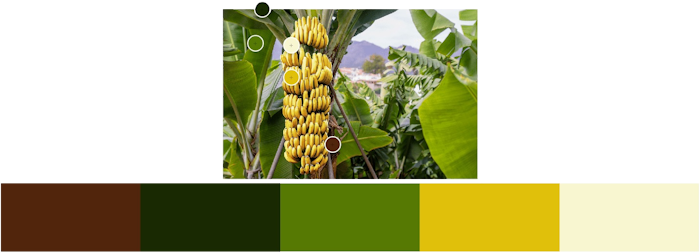

### Typography

### Images

### Logo and Favicon

[Back to top](#table-of-contents)

## Features

### Welcome screen

The ...

Screenshot of the feature
 

 

### Feature 2

The ...

Screenshot of the feature
 

 

### Feature 2

The ...

Screenshot of the feature
 

 

### Security Features and Defensive Design

TODO
Validating every user input creates a defensive design that runs correctly and keeps running no matter what action the user takes.

## Future features
-

[Back to top](#table-of-contents)

# Project planning and execution

### Design thinking

TODO (maybe)

### Wireframes

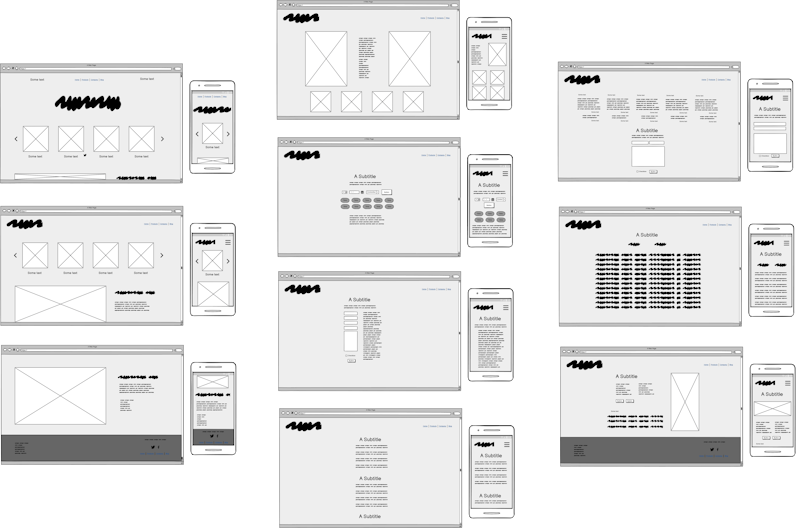

Initial wireframes as a guide for development and design.

Screenshots of individual wireframes for the:

top part of home page
 
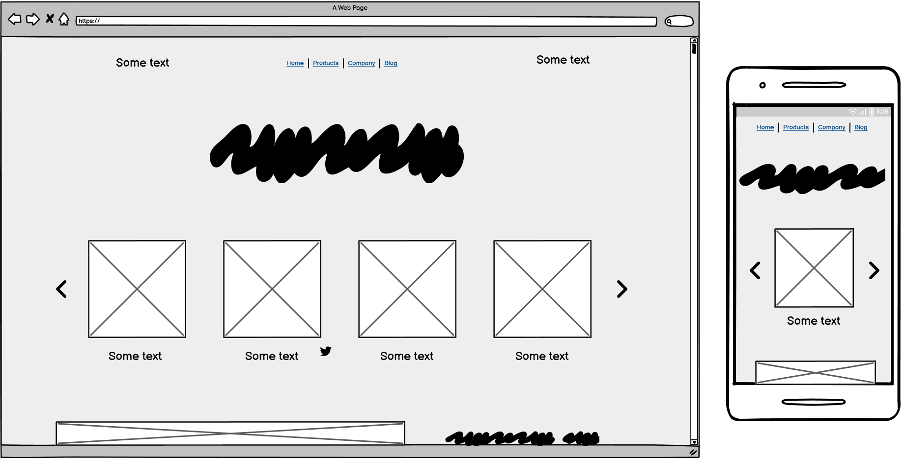
 

middle part of home page
 
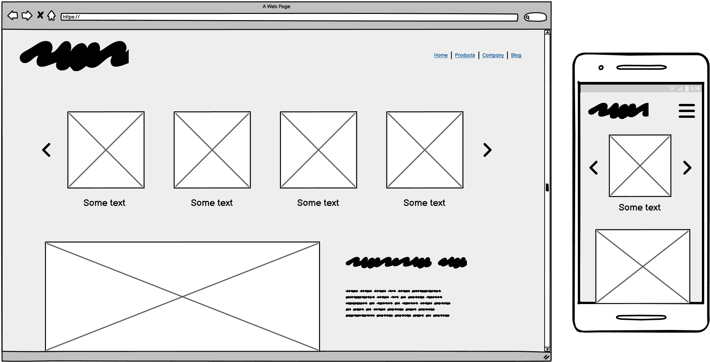
 

bottom part of home page
 
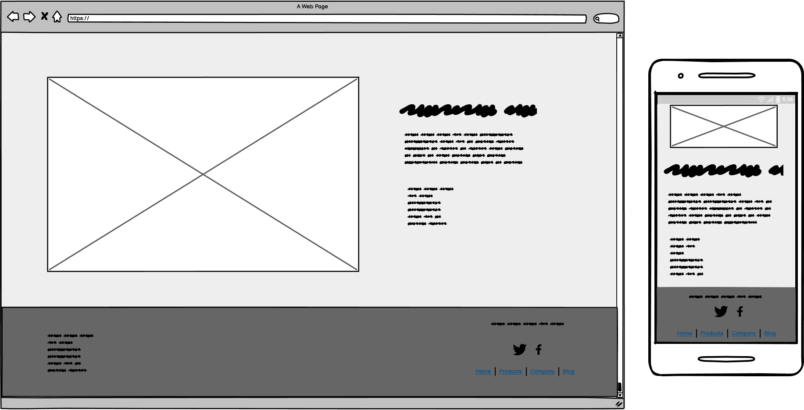
 

about page
 
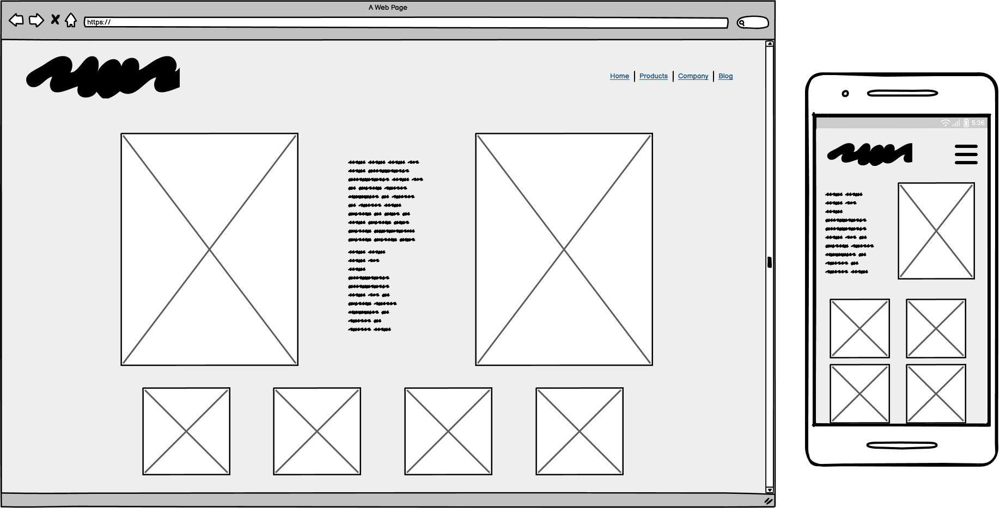
 

users profile page
 
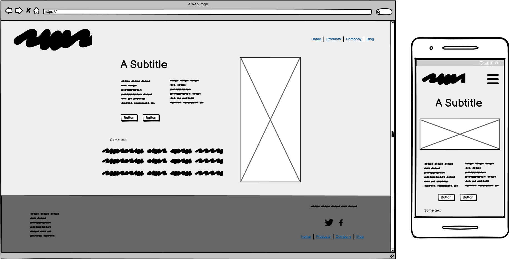
 

owners profile page
 
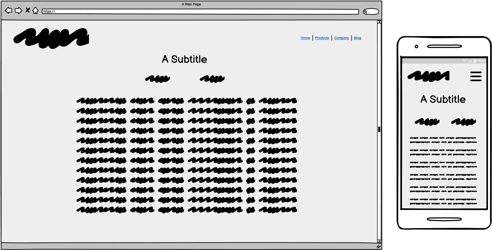
 

booking page with date and time
 
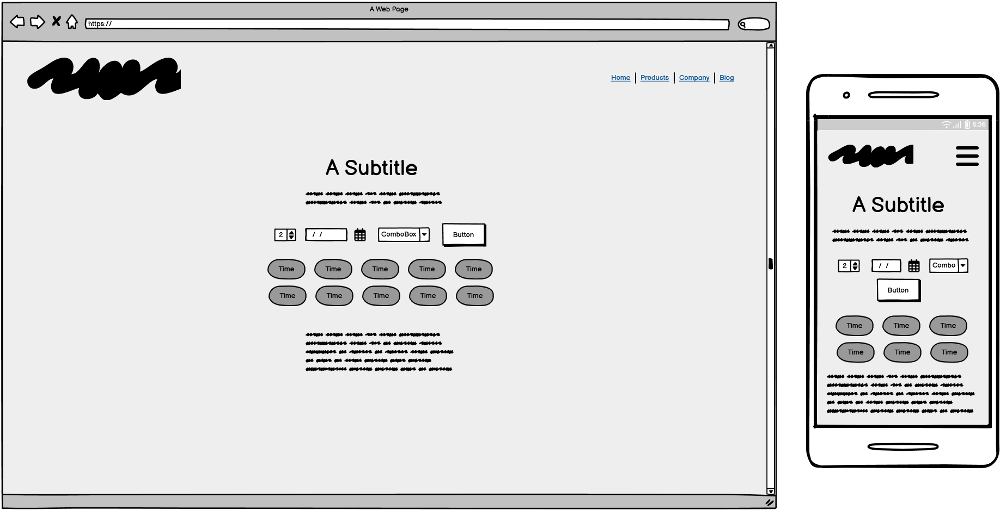
 

booking page with personal info
 
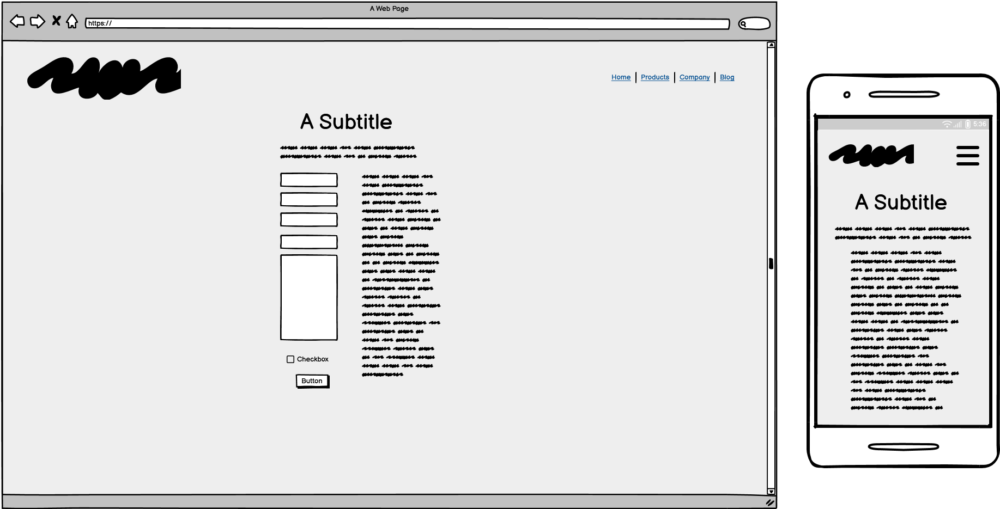
 

menu page
 
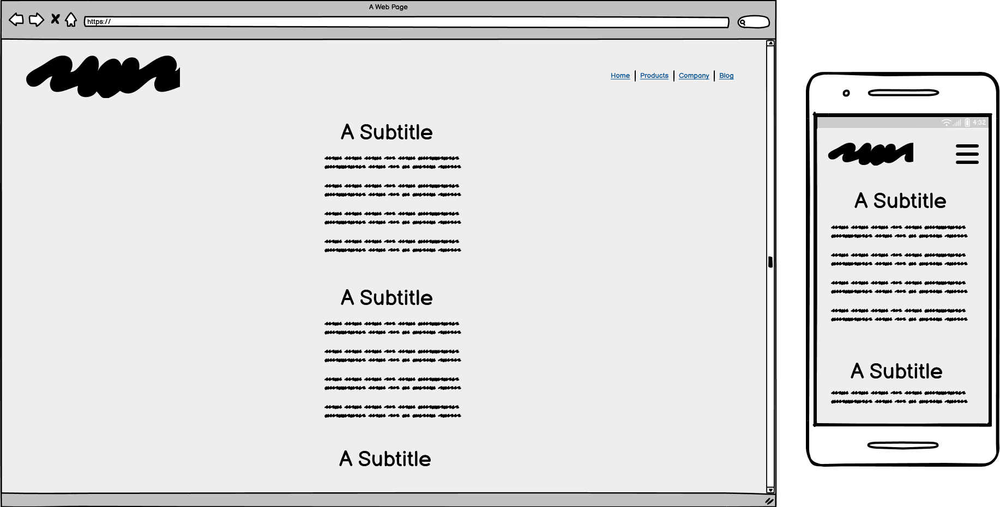
 

feedback section
 
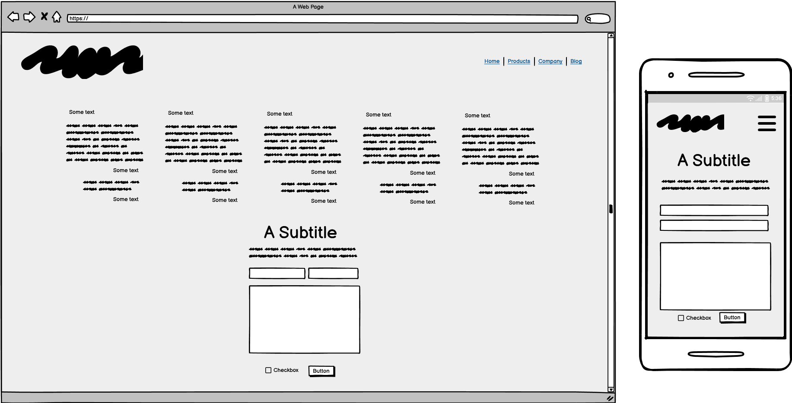
 

### Database Schema

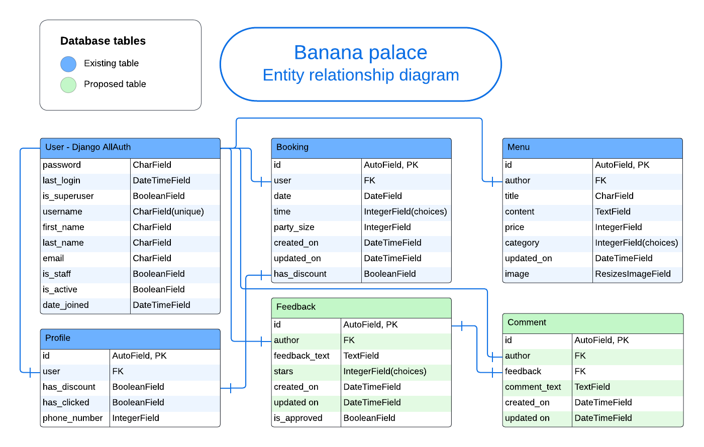

TODO
PostgreSQL
Relational database

## Agile software development

Scrum, using both incremental and iterative development, was chosen as the main Agile methodology to use in this project. Planning workload into iterations, also known as sprints, with a mindset of "continuous improvement". For each iteration, a kanban board was used to visualize the current workload. Between iterations, remaining workload in the product backlog was reviewed and next iteration was planned.

All features that could possibly be implemented were added as [issues on GitHub.](https://github.com/NiclO1337/pp4-banana-palace/issues)  (*Hold Ctrl (or Cmd) and click to open in a new window.*)

### Epics

Project was broken down into different epics, large bodies of work, with features that might be included in the project. Each epic in turn is broken into smaller user stories where each user story provides a value to a specified user. User stories were created from both restaurant owner and users of the website.

TODO

Screenshot of
 

 

### User stories

All user stories are added as [issues](https://github.com/NiclO1337/pp4-banana-palace/issues) on GitHub. They consist of what value they brings, which acceptence criteria is required for it to be marked as complete and some tasks to complete.

Screenshot of example of a user story
 

 

### Product backlog

PBI's
backlog refinement
GitHub Milestones [link]

### MoSCoW prioritization

Each iteration

### Iterations

GitHub Milestones [link]

Screenshot of the start of iteration 1
 
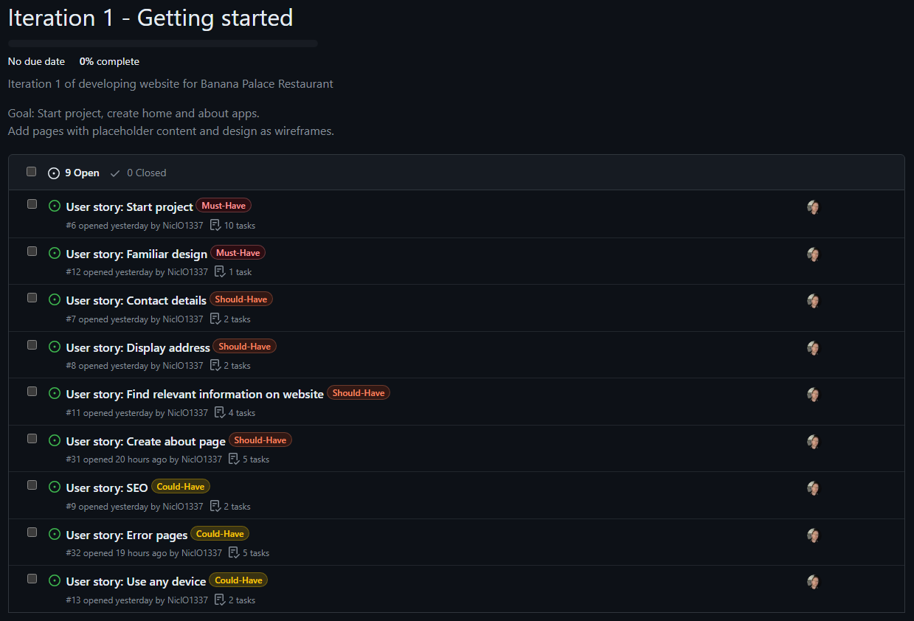
 

Screenshot of the end of iteration 1
 

 

Screenshot of the start of iteration 2
 

 

Screenshot of the end of iteration 2
 

 

Screenshot of the start of iteration 3
 

 

Screenshot of the end of iteration 3
 

 

Screenshot of the start of iteration 4
 

 

Screenshot of the end of iteration 4
 

 

Screenshot of the start of iteration 5
 

 

Screenshot of the end of iteration 5
 

 

### Kanban board

Github projects was used as a kanban board during development. In each iteration, relevant user stories are moved onto the board and development began. Features were developed to fulfil the acceptence critera's of the user stories.

Link to [Kanban board](https://github.com/users/NiclO1337/projects/3/views/1) used on GitHub. (*Hold Ctrl (or Cmd) and click to open in a new window.*)

[Back to top](#table-of-contents)

## Technologies used

### Languages
- HTML
- CSS
- JavaScript
- Python

### Frameworks
- **Django 5.0.2** as main framework for web development
- **Bootstrap v5.3** as framefork for styling and positioning
- **jQuery** for more efficient DOM manipulation

### Libraries
- **Os**, provides functions for interacting with the operating system
- **psycopg2**, PostgreSQL database adapter for the Python programming language
- **dj-database-url**, enables the ability to represent their database settings via a string
- **gunicorn**, handles HTML rendering, authentication, administration, and backend logicgit

### Tools
- **Git** for source control
- **GitHub** for storing software project
- **Heroku** for deployment
- **Balsamiq** for all of the wireframes
- **Lucidchart** for ERD (entity relationship diagram)
- **VS Code** as primary IDE during development
- **w3schools** for general information
- **Stack Overflow** for specific issues/errors
- **Looka.com** for the logo and symbol
- **Favicon.io** for the favicon
- **color.adobe.com** to extract color pallet from image
- **Bootstrap Docs** to build page structure and design
- **Bootstrap GitHub page** to check properties of classes
- **Django Docs** to build project and apps
- **Grammarly** for spellchecking
- **cdnjs.com** to find relevant CDN fast

## Testing

Testing made in separate file [TESTING.md](TESTING.md)

## Deployment

#### Deployment to Heroku

TODO

1. Log in (or sign up) to Heroku. ( https://www.heroku.com/ )
2. From the dashboard, create a "new app" and follow the instructions.
3. When created go to the settings tab.
    - Add a Config Var with PORT as the key and 8000 as value.
    - TODO
4. Go to the deployment tab.
    - Select GitHub as deployment method.
    - Connect app to the correct repository.
5. Choose to deploy either manully or enable automatic deploys.

#### Changes to the code
If changes has been made in local development, the requirements.txt might need to be updated.
- It is done by entering the following command in the terminal: 'pip3 freeze > requirements.txt'
- Updated file must then be commited and pushed to GitHub.

### Local development

#### Forking the project

1. Log in (or sign up) to Github.
2. Go to the repository for this project, [Banana Palace](https://github.com/NiclO1337/pp4-banana-palace).
 (*Hold Ctrl (or Cmd) and click to open in a new window.*)
3. Click the Fork button in the top right corner.

#### Cloning the project

1. Log in (or sign up) to Github.
2. Go to the repository for this project, [Banana Palace](https://github.com/NiclO1337/pp4-banana-palace).
 (*Hold Ctrl (or Cmd) and click to open in a new window.*)
3. Click on the code button, select whether you would like to clone with HTTPS, SSH, or GitHub CLI, and copy the link shown.
4. Open the terminal in your code editor and change the current working directory to the location you want to use for the cloned directory.
Type 'git clone' into the terminal and then paste the link you copied in step 3.
5. Press enter.

TODO: Optional, create viritual environment.
TODO: install requirements with correct versions

[Back to top](#table-of-contents)

## Credits

### Content

- Design and content inspiration from: [Getbento](https://www.getbento.com/blog/best-restaurant-websites-design/)
and [Limely](https://www.limely.co.uk/blog/top-restaurant-website-designs)

- Footer link idea from above websites, mainly from [dim t](https://dimt.co.uk/book/)

### Media

- Logo
- Favicon

- Image from

### Code

- Inspiration from my own previous portfolio projects.
  - HTML/CSS from [Strawberry lovers](https://github.com/NiclO1337/pp1-strawberry-lovers)
  - JS from [RPS Battle Arena](https://github.com/NiclO1337/pp2-playtime)

- Some of the code from the Codestar blog walkthrough project was used and adapted.

- Navbar adjusted when scroll down: [w3schools](https://www.w3schools.com/howto/tryit.asp?filename=tryhow_js_navbar_shrink_scroll)

- Multiple items per carousel slide from [Hello Mev](https://codepen.io/hellomev/pen/LYORMQW)

- Information on good way to divide up templates and link them - [Stack Overflow answer](https://stackoverflow.com/questions/16498176/is-dividing-a-template-into-parts-and-including-each-part-bad)

- How to animate the navbar toggler from [Clueless Expert](https://www.youtube.com/watch?v=vJ85fm4m7lw)

[Back to top](#table-of-contents)