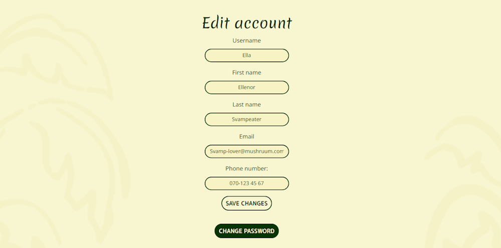

#  Banana Palace restaurant

Link to live website: [Banana Palace](https://banana-palace-9ad263ab8cf3.herokuapp.com/)  (*Hold Ctrl (or Cmd) and click to open in a new window.*)

## Table of contents

* [Introduction](#introduction)
    * [Website goals](#website-goals)
    * [First time user goals](#first-time-user-goals)
    * [Returning user goals](#returning-user-goals)
* [UX and UI](#ux-and-ui---user-experience-and-user-interface)
    * [Mobile first development](#mobile-first-approach)
    * [Accessibility](#accessibility)
* [Design](#design)
    * [Colours](#colours)
    * [Typography](#typography)
    * [Images](#images)
    * [Logo and Favicon](#logo-and-favicon)
* [Features](#features)
    * [First page](#first-page)
    * [Menu](#menu)
    * [Account](#account)
    * [Discount](#discount)
    * [Reservation](#reservation)
    * [Security Features and Defensive Design](#security-features-and-defensive-design)
        * [User Authentication](#user-authentication)
        * [User Authorization](#user-authorization)
        * [Form Validation](#form-validation)
        * [Error Handling](#error-handling)
        * [Security Measures for Sensitive Information](#security-measures-for-sensitive-information)
        * [CSRF Protection](#csrf-protection)
    * [Future features](#future-features)
* [Project planning and execution](#project-planning-and-execution)
    * [Design thinking](#design-thinking)
    * [Wireframes](#wireframes)
    * [Database Schema](#database-schema)
        * [Business goals](#business-goals)
        * [Progressive data model](#progressive-data-model)
        * [Conceptional](#conceptional)
        * [Logical](#logical)
        * [Physical](#physical)
    * [Agile software development](#agile-software-development)
        * [Epics](#epics)
        * [User stories](#user-stories)
        * [Product backlog](#product-backlog)
        * [MoSCoW prioritization](#moscow-prioritization)
        * [Iterations](#iterations)
        * [Kanban board](#kanban-board)
    * [Technologies used](#technologies-used)
        * [Languages](#languages)
        * [Frameworks](#frameworks)
        * [Libraries](#libraries)
        * [Tools](#tools)
* [Testing](#testing)
* [Deployment](#deployment)
    * [Local development](#local-development)
        * [Forking](#forking-the-project)
        * [Cloning](#cloning-the-project)
        * [Development server](#running-a-development-server)
        * [Changes](#changes-to-the-code)
    * [Heroku](#deployment-to-heroku)
* [Credits](#credits)
    * [Honorable mentions](#honorable-mentions)
    * [Content](#content)
    * [Media](#media)
    * [Code](#code)

## Introduction

Welcome to Banana Palace restaurant, where culinary excellence meets heartfelt hospitality. Our journey began with a simple passion – to create a dining experience that not only tantalizes the taste buds but also warms the soul.

### Website goals
- Get a stronger online presence to attract new customers
- Make it easier for existing customers to make reservations
- Enable regulars to be able to book their favorite table

### First time user goals
- Learn about the restaurant, the history and the dining experience
- Find where it is located and when it is open
- Read the menu and see images of the signature dishes
- Find contact details and social media accounts
- Get information about the terms and conditions as well as company policies
- Reserve a table

### Returning user goals
- Get a reminder about restaurant information
- See their existing reservations and perhaps edit them
- Make another reservation to try more of the exciting dishes

## UX and UI - (user experience and user interface)

### Mobile first approach
All pages are designed to be responsive to different screen sizes to accommodate users with different preferred devices. Designing with a mobile-first approach involves considering the constraints and capabilities of mobile devices first, such as smaller screen sizes, touch interfaces, and slower internet connections. By starting with the mobile experience, we focus on delivering essential content and functionality in a concise and user-friendly manner.

Screenshot examples of responsive behavior from mobile to tablet to computer
 

 

### Accessibility

Semantic HTML plays a crucial role in web accessibility by providing meaningful structure and context to web content. By using semantic elements such as header, nav, main, section, article, aside, and footer in this project it is not only well-organized for search engines but also easily navigable for users, including those with disabilities.

For individuals with visual impairments, screen readers are essential tools for accessing web content. Alternative text, often referred to as "alt text," is a concise description added to all images with semantic meaning. In addition to alt text, aria-labels (Accessible Rich Internet Applications Labels) are used to increase accessibility even further. Aria-labels are attributes that can be added to elements, particularly interactive elements like buttons, links, and form elements, to provide additional context or descriptive labels for screen reader users. Unlike alt text, which is specific to images, aria-labels are applied to a wide range of HTML elements to enhance accessibility.

## Design

### Colours

 

The choice of colors for this project draws direct inspiration from the vibrant and natural hues found in a banana tree. By channeling the natural beauty and diversity of the banana tree, our color palette not only reflects the essence of the project but also infuses it with a touch of organic elegance and timeless charm.

### Typography

#### Headings and special texts - Merienda (Google font)

The font Merienda was chosen to add a personal, aesthetic, and emotional dimension to the user experience. It reflects a deliberate design decision aimed at creating a welcoming atmosphere, fostering a sense of connection, and reinforcing the brand's identity.

#### Buttons and links - M PLUS Rounded 1c (Google font)

The rounded curves of this font complement the overall project seamlessly. The soft curves evoke a sense of friendliness and approachability. The uniformity in design achieved through this font choice creates a cohesive visual identity, ensuring consistency across various elements of the project.

#### Main font for texts - Noto Sans (Google font)

This font features a contemporary design with subtle geometric elements and graceful curves, giving it a modern appearance. Noto Sans is a superior choice for this project due to its versatility, clarity, accessibility, modern aesthetics, consistency, open-source nature, and optimization for digital displays.

### Images

In selecting images for this establishment, careful consideration was given to the atmosphere and experience we aim to cultivate for our diners. Each image was chosen thoughtfully, with the intention of creating a warm and inviting ambiance that encourages guests to feel comfortable and at ease from the moment they step through our doors. Additionally, these images were curated to evoke a sense of excitement and anticipation surrounding the dining experience.

### Logo and Favicon

The Banana Palace restaurant logo serves as the focal point around which all design decisions were crafted. Designed to embody a perfect blend of sophistication and enjoyment, it features elegant and playful curves that capture the essence of the establishment. At its core lies the symbol of a banana tree, symbolizing the restaurant's core offering and identity.

Derived from the logo symbol, the favicon, a condensed representation of the brand, was meticulously crafted. It draws upon the color palette of the brand, carefully selecting hues that offer the highest contrast for maximum visibility and recognition. Through this strategic choice of colors, the favicon stands out prominently, ensuring its presence is unmistakable across digital platforms.

[Back to top](#table-of-contents)

## Features

### First page

The initial page is meticulously crafted to provide users with comprehensive information about the site's purpose. A prominent logo ensures instant brand recognition, while contact details and the address are readily visible for easy access. The navigation bar succinctly displays all available sections, while tantalizing teaser images aim to pique the user's interest.

Header and footer elements, complete with navigation links, are incorporated across all pages to ensure consistency and foster a sense of familiarity for users. The header features links to the most relevant pages for visitors of the website. The footer contains useful information and links as per the standard convention of restaurant websites.

The welcome section features a captivating image that encapsulates the restaurant's ambiance, inviting users to experience its unique atmosphere. Paired with a heartfelt invitation, it sets the stage for an enticing journey, urging visitors to explore the culinary delights within.

The index page captivates visitors with an engaging carousel slider that elegantly showcases the restaurant's signature dishes. With each slide, users are treated to tantalizing glimpses of the culinary delights awaiting them. From succulent main courses to delectable desserts, the carousel invites exploration and ignites the senses, offering a preview of the gastronomic journey that lies ahead. Through vibrant imagery and enticing descriptions, the carousel slider serves as a tempting invitation to indulge in an unforgettable dining experience.

Screenshot of the initial page
 

 

Screenshot of the header 
 

 

Screenshot of the footer
 

 

Screenshot of the welcome section
 

 

Screenshot of the carousel
 

 

### Menu

The menu shows all dishes that the restaurant currently is offering. Two out of five categories are currently in use. The categories are starters, mains, desserts, drinks and kids. When a menu item is added with the category it is automatically displayed on the website. If there are no current menu items in a category, the category is hidden on the page.

Furthermore, staff members possess the capability to add and edit menu items while logged into the system. They also have the ability to mark items as inactive using the 'Is current' BooleanField option.

However, full CRUD (Create, Read, Update, Delete) permissions are exclusively granted to the owner, enabling them to delete menu items as needed.

Screenshot of the menu
 

 

Screenshot of the add menu item and edit feature
 

 

Screenshot of edit form for menu items
 

 

Screenshot of the inactive menu items
 

 

Screenshot of owners delete option
 

 

### Account

The user account page provides a comprehensive overview of personal information and current reservations. Users have complete control over their accounts with the ability to modify account details, update password, and even delete their account if desired. When editing account details, current user information is automatically added to the form. To maintain the integrity of user registrations, email verification is enforced, ensuring that only committed individuals access the website. Throughout all account-related actions and CRUD operations, users receive confirmation messages to keep them informed on performed actions.

Moreover, for actions with irreversible consequences, such as deleting the account, an additional layer of verification is implemented on a separate page. This precautionary measure helps prevent accidental account deletions or other irreversible actions, safeguarding users from unintended consequences.

The owner has a custom account page where he can perform actions. He can delete old items from the database, and he can see all current users and can choose to grant discount to select a few users.

Screenshot of the email verification.
 

 

Screenshot of the account page
 

 

Screenshot of the edit form
 

 

Screenshot of the delete
 

 

Screenshot of the confirmation message
 

 

Screenshot of the owners account page
 

 

### Discount

The owner can choose to grant a special friends and family discount to user accounts from their account page. After being granted the discount, the next time the user logs in they will see a new icon on their profile. When they click the button they are taken to a surprice page and then granted the discount.

Screenshot of the owners account page
 

 

Screenshot of message confirming that discount has changed
 

 

Screenshot of icon on user account
 

 

Screenshot of surprise page
 

 

Screenshot of account page after clicking the icon
 

 

### Reservation

When making a reservation, guests have the opportunity to select their preferred table. The restaurant has distinct themes in various sections, providing each diner with a unique and immersive dining experience.

Users have the convenience of checking availability for any date within the next 12 months starting from today, allowing them to select their desired table for specific days. Once they've made their decision, a simple click on the chosen table initiates the reservation process. If users have previously provided personal and contact details in their account, these details are automatically filled into the reservation form. Any changes made to this information during the reservation process are seamlessly updated in their account.

In order to confirm the booking, users are required to accept the terms and conditions, with a convenient link provided for easy access to the relevant information. The terms and conditions page is designed with user-friendliness in mind, featuring a prominent button enabling users to return to the previous page, allowing them to seamlessly resume their reservation process after reviewing the terms.

Once a reservation is confirmed, it becomes accessible within their account dashboard, offering the flexibility to edit or cancel existing bookings at their convenience.

Screenshot of the table reservation page
 

 

Screenshot of the reservation details page
 

 

Screenshot of the terms and conditions page
 

 

Screenshot of the account page with reservation made
 

 

Screenshot of the account page with edited reservation
 

 

### Security Features and Defensive Design

Security features are integrated measures designed to safeguard the website, ensuring protection against various threats and vulnerabilities while maintaining a seamless user experience. Different sections of the website are fortified in unique ways to deter unauthorized tampering and maintain data integrity. Designed with security in mind by limiting access, handling errors properly, using secure coding practices, and testing for vulnerabilities.

#### User Authentication
Authentication of users is handled through Django-AllAuth. Certain sections of the application are accessible only to logged-in users, and access to these pages is secured using Django's login required decorator, which grants role-based access to the central dataset. If a user attempts to access these restricted pages without being logged in, they are automatically redirected to the login page.

#### User Authorization
Users are authorized to perform CRUD operations only on their own accounts and reservations. Backend operations always verify the user's identity to prevent unauthorized tampering. Successful operations are contingent on the user being both the requester of the change and the owner of the affected account.

#### Form Validation
Django's native form validation is employed to ensure accuracy and completeness of data entry throughout the application. Forms are configured not to submit unless all required fields are correctly filled. Additionally, form data undergoes thorough validation checks in the backend to maintain data integrity and security. In cases of errors, informative messages are displayed to guide users in correcting their entries.

#### Error Handling
Error pages for common HTTP errors (400, 403, 404, and 500) include 'Return to the home page' buttons, aiding users in navigating back to the application's main interface.

#### Security Measures for Sensitive Information
Sensitive environment variables are stored locally in env.py during development to prevent inadvertent exposure on GitHub. In production, these variables are securely managed as Config Vars within the Heroku application environment. Furthermore, passwords are stored securely within Django AllAuth, utilizing industry-standard encryption methods. This ensures that sensitive user information, including passwords, remains inaccessible to unauthorized individuals.

#### CSRF Protection
To mitigate the risk of Cross-Site Request Forgery (CSRF) attacks, CSRF tokens are embedded in every form, providing an additional layer of authentication when requests are submitted. This safeguard helps prevent unauthorized data access or manipulation by malicious third parties.

### Future features
All remaining user stories at the project deadline are stored in the product backlog, awaiting the next development cycle for implementation. [GitHub milestone](https://github.com/NiclO1337/pp4-banana-palace/milestone/1) is used as the backlog for this project.

[Back to top](#table-of-contents)

## Project planning and execution

### Design thinking

TODO (maybe)

### Wireframes

Initial wireframes as a guide for development and design.

Screenshots of individual wireframes for the:

top part of home page
 

 

middle part of home page
 

 

bottom part of home page
 

 

about page
 

 

users profile page
 

 

owners profile page
 

 

booking page with date and tables
 

 

booking page with personal info
 

 

menu page
 

 

feedback section
 

 

### Database Schema

A relational database is used for this project, it is a PostgreSQL provided by Code Institute.  Entity relationship diagrams (ERD) are used to plan the SQL tables and relationships, i.e. how tables interact with eachother.

#### Business goals
- The menu is visible on website and can easily be edited.
- Customers can reserve tables if they register an account.
- Customers can make multiple reservations in advance.
- Reservations are limited to 1 per customer per day
- Each table is avalible for booking once per day, rest of the time it is saved for walk-in customers.
- Customers can leave reviews about their experience.
- Staff members can comment on customers reviews.
- A select few customers can recieve a friends and family discount.

#### Progressive data model
A progressive data model is used with three levels of abstraction.  These evolving stages bridges the communication gap between buisness people and the technical team.

#### Conceptional
The conceptional ERD is used by business analysts to bind the scope, key entities, and relationships in a way that is easy for the business people to confirm and understand. Business goals are used as guide to create tables at this stage. See image below.

#### Logical
When the conceptional stage is complete and confirmed, the logical ERD evolves the conceptional by going deeper into what each table need and what type of relationships that will be needed. Business analysts provide a simple visual that both business people and the development team can understand. See image below.

#### Physical
Lastly the development team elaborates upon the logical model with data specifications to transforms it into a blueprint for building and implementing the database. See image below.

## Agile software development

Scrum, using both incremental and iterative development, was chosen as the main Agile methodology to use in this project. Planning workload into iterations, also known as sprints, with a mindset of "continuous improvement". For each iteration, a kanban board was used to visualize the current workload. Between iterations, remaining workload in the product backlog was reviewed and next iteration was planned.

All features that could possibly be implemented were added as [issues on GitHub.](https://github.com/NiclO1337/pp4-banana-palace/issues)  (*Hold Ctrl (or Cmd) and click to open in a new window.*)

### Epics

Project was broken down into different epics, large bodies of work, with features that might be included in the project. Each epic in turn is broken into smaller user stories where each user story provides a value to a specified user. User stories were created from both restaurant owner and users of the website.

Screenshot of one of the Epics
 

 

### User stories

All user stories are added as [issues on GitHub.](https://github.com/NiclO1337/pp4-banana-palace/issues) They consist of what value they brings, which acceptence criteria is required for it to be marked as complete and tasks to complete. Some commits were linked to the user story they completed a task for.

Screenshot of example of a user story
 

 

Screenshot of example of user story commits
 

 

### Product backlog

All deliverable user stories are added to the product backlog. [GitHub milestone](https://github.com/NiclO1337/pp4-banana-palace/milestone/1) is used as the backlog for this project. They are prioritized, top to bottom, based on their readiness to be completed and what needs to be delivered first. PBI's (product backlog items) are reviewed and re-prioritized between development iterations, also known as backlog refinement.

### MoSCoW prioritization

The MoSCoW prioritization was used for this project. While planning each iteration, user stories are divided into categories depending on their importance to the project at this stage in development. Remaining user stories at the end of the iteration are marked as WONT-HAVE for this iteration and returned to the product backlog for review. They can still be developed in future iterations if time permits.

### Iterations

Iteration process were tracked as [GitHub milestones](https://github.com/NiclO1337/pp4-banana-palace/milestones) for this project.

Screenshot of the start of iteration 1
 

 

Screenshot of the end of iteration 1
 

 

Screenshot of the start of iteration 2
 

 

Screenshot of the end of iteration 2
 

 

Screenshot of the start of iteration 3
 

 

Screenshot of the end of iteration 3
 

 

Screenshot of the start of iteration 4
 

 

Screenshot of the end of iteration 4
 

 

Screenshot of the start of iteration 5
 

 

Screenshot of the end of iteration 5
 

 

### Kanban board

Github projects was used as a kanban board during development. In each iteration, relevant user stories are moved onto the board and development began. Features were developed to fulfil the acceptence critera's of the user stories. When the acceptence criteria has been tested in development and production environment, it is marked as completed and moved to "Done" column.

Link to [Kanban board](https://github.com/users/NiclO1337/projects/3/views/1) used on GitHub. (*Hold Ctrl (or Cmd) and click to open in a new window.*)

[Back to top](#table-of-contents)

## Technologies used

### Languages
- HTML
- CSS
- JavaScript
- Python

### Frameworks
- **Django 5.0.2** as main framework for web development
- **Bootstrap v5.3.2** as framefork for styling and positioning
- **jQuery** for more efficient DOM manipulation

### Libraries
- **Os**, provides functions for interacting with the operating system
- **datetime**, supplies classes to work with date and time
- **psycopg2**, PostgreSQL database adapter for the Python programming language
- **dj-database-url**, enables the ability to represent their database settings via a string
- **gunicorn**, handles HTML rendering, authentication, administration, and backend logic
- **whitenoise**, allows web app to serve its own static files
- **Allauth**, dealing with account authentication, registration, management, and third-party (social) account authentication
- **django-crispy-forms**, controls the rendering behavior of Django forms
- **crispy-bootstrap**, enables crispy forms to use bootstrap for styling
- **django-phonenumber-field**, validates, pretty print and convert phone numbers
- **django-money**, add support for Money fields in models and forms
- **pillow**, image resizing, rotation and transformation

### Tools
- **Git** for source control
- **GitHub** for storing software project
- **Heroku** for deployment
- **Balsamiq** for all of the wireframes
- **Lucidchart** for ERD (entity relationship diagram)
- **VS Code** as primary IDE during development
- **w3schools** for general information
- **Stack Overflow** for specific issues/errors
- **Looka.com** for the logo and symbol
- **Favicon.io** for the favicon
- **color.adobe.com** to extract color pallet from image
- **Bootstrap Docs** to build page structure and design
- **Bootstrap GitHub page** to check properties of classes [Link to v5.3.2](https://github.com/twbs/bootstrap/blob/v5.3.0/dist/css/bootstrap.css)
- **Django Docs** to build project and apps
- **Grammarly** for spellchecking
- **cdnjs.com** to find relevant CDN fast
- **paint.net** to edit logo, images and favicon
- **phind.com** to search for specific solutions
- **ChatGPT** to generate text content for website

## Testing

Testing made in separate file [TESTING.md](TESTING.md)

## Deployment

### Local development

#### Forking the project

1. Log in (or sign up) to Github.
2. Go to the repository for this project, [Banana Palace](https://github.com/NiclO1337/pp4-banana-palace).
 (*Hold Ctrl (or Cmd) and click to open in a new window.*)

3. Click the Fork button in the top right corner.

#### Cloning the project

1. Log in (or sign up) to Github.
2. Go to the repository for this project, [Banana Palace](https://github.com/NiclO1337/pp4-banana-palace) or your forked copy.
 (*Hold Ctrl (or Cmd) and click to open in a new window.*)

3. Click on the code button, select whether you would like to clone with HTTPS, SSH, or GitHub CLI, and copy the link shown.
4. Open the terminal in your code editor and change the current working directory to the location you want to use for the cloned directory.
Type 'git clone' into the terminal and then paste the link you copied in step 3.
5. Press enter.

#### Running a development server

1. First create an env.py file and input variables for DATABASE_URL, SECRET_KEY, EMAIL_HOST_USER and EMAIL_HOST_PASSWORD.
2. Create a virtual environment in your workspace.
3. Install all the required dependencies in your workspace with 'pip install -r requirements.txt' command in the terminal
4. Run the server with the command 'python manage.py runserver'

#### Changes to the code
If changes has been made in local development that requires new dependencies, these needs to be added to the requirements.txt file. It is done by entering the following command in the terminal: 'pip3 freeze > requirements.txt'. Updated requirements file must then be added, commited, and pushed to GitHub.

### Deployment to Heroku

1. Log in (or sign up) to Heroku. ( https://www.heroku.com/ )
2. From the dashboard, create a "new app" and follow the instructions.
3. When created go to the settings tab and add a Config Var for:
    - DATABASE_URL
    - SECRET_KEY
    - EMAIL_HOST_USER
    - EMAIL_HOST_PASSWORD
4. Go to the deployment tab.
    - Select GitHub as deployment method.
    - Connect app to the correct repository.
5. Choose to deploy either manully or enable automatic deploys.

[Back to top](#table-of-contents)

## Credits

### Honorable mentions

- Thanks [Erik](https://github.com/Tossan99) for inspiring me to have fun and take risks to create the best possible project!
- To all lovely people in our #community-sweden slack channel: Thank you for endless support and great laughs!
- Thanks to my mentor Jubril Akolade for guidance and great advice.

### Content

- Design and content inspiration from: [Getbento](https://www.getbento.com/blog/best-restaurant-websites-design/)
and [Limely](https://www.limely.co.uk/blog/top-restaurant-website-designs)

- Footer link idea from above websites, mainly from [dim t](https://dimt.co.uk/book/)

- Hours & location text from [Colletta Atlanta](https://www.collettarestaurant.com/location/colletta-atlanta/)

- Menu recipe and images from Yummly, [Main courses](https://www.yummly.com/recipes?q=banana+dinner&allowedIngredient=meat&allowedIngredient=bananas&qgs=with+meat&taste-pref-appended=true) and [Desserts](https://www.yummly.com/recipes?q=desserts&taste-pref-appended=true&allowedIngredient=bananas)

### Media

- Logo created by AI tool - [Looka.com](https://looka.com/logo-maker/)

- Favicon created from logo with help of [paint.net](https://www.getpaint.net/)

- Banana gif from GIF by [Triter on Pixabay](https://pixabay.com/gifs/beach-camera-banana-3d-7183/)

#### Index page
- Photo by [Pierre Blaché](https://www.pexels.com/sv-se/foto/restaurang-solnedgang-hus-manniskor-2901215/)

#### About page
- Photo by [Rene Asmussen](https://www.pexels.com/sv-se/foto/restaurang-hus-bord-arkitektur-1581384/)
- Photo by [Tamas Tuzes-Katai](https://unsplash.com/photos/person-holding-white-iphone-5-c-rEn-AdBr3Ig)
- Photo by [Rachel Claire](https://www.pexels.com/sv-se/foto/mat-restaurang-drycker-stilleben-6127316/)
- Photo by [Pablo Merchán Montes](https://unsplash.com/photos/woman-holding-fork-in-front-table-Orz90t6o0e4)
- Photo by [Lisa Fotios](https://www.pexels.com/sv-se/foto/restaurang-lampor-foretag-interior-776538/)
- Photo by [Rachel Claire](https://www.pexels.com/sv-se/foto/tallrik-restaurang-semester-konst-4577179/)

### Code

- Inspiration from my own previous portfolio projects.
  - HTML/CSS from [Strawberry lovers](https://github.com/NiclO1337/pp1-strawberry-lovers)
  - JS from [RPS Battle Arena](https://github.com/NiclO1337/pp2-playtime)

- Some of the code from the Code Institutes blog walkthrough project was used and adapted.

- This project from a fellow classmate was a good help many times during my development: [Amy Richardson](https://github.com/amylour/FreeFido_v2)

- Navbar adjusted when scroll down: [w3schools](https://www.w3schools.com/howto/tryit.asp?filename=tryhow_js_navbar_shrink_scroll)

- Multiple items per carousel slide from [Hello Mev](https://codepen.io/hellomev/pen/LYORMQW)

- Information on good way to divide up templates and link them - [Stack Overflow answer](https://stackoverflow.com/questions/16498176/is-dividing-a-template-into-parts-and-including-each-part-bad)

- How to animate the navbar toggler from [Clueless Expert](https://www.youtube.com/watch?v=vJ85fm4m7lw)

- How to create entity relationship diagrams from [The Business Analysis Doctor](https://www.youtube.com/watch?v=wMgirP7z4k8&t=2s)

- Django tutorial by [Net Ninja](https://www.youtube.com/playlist?list=PL4cUxeGkcC9ib4HsrXEYpQnTOTZE1x0uc) 
Outdated content but Shaun is amazing at explaining things.
Specifically used for urls and views.

- Django tutorial by [Hana Belay](https://dev.to/earthcomfy/django-user-profile-3hik) 
How to extend user model and update account information.

- Delete account guide by [Cloud With Django](https://www.youtube.com/watch?v=wRFUTDBUgsA)

- Fireworks CSS by [Eddie Lin](https://jsfiddle.net/elin/7m3bL/)

- Insert data in database by [Anjaneyulu Batta](https://learnbatta.com/course/django/insert-data/)

- Loading screen animation by [Tobias Ahlin](https://tobiasahlin.com/spinkit/)

#### Phind.com

After spending too many hours on google trying various outdated or incorrect or incapatible solutions I changed tactic and tested phind.com because of multiple recommendations. Immediatly amazed at the speed and accuracy of search results.

- Better looking datepicker: [Phind search 1](https://www.phind.com/search?cache=q6943vmjbf51bp9848g2hlcb)

- Help with how to get date from datepicker as a variable: [Phind search 2](https://www.phind.com/search?cache=sqrlc22rb0n70z8fbuh61mvs)

- Help with specific server error due to mistake in code: [Phind search 3](https://www.phind.com/search?cache=hlyju3zxzwvjql9yktalgy49)

- Help with adding and styling jQuery datepicker: [Phind search 4](https://www.phind.com/search?cache=ikbfeuzueqibp1far0jj35pt)

- Cascading save from one model to another: [Phind search 5](https://www.phind.com/search?cache=f2dg3carzn3lkulie483rui5)

- Limit avalible dates in datepicker: [Phind search 6](https://www.phind.com/search?cache=abcz5qcai1whrk4z47hjtd7g)

- Use form fields from multiple Models in same form: [Phind search 7](https://www.phind.com/search?cache=j714958f5qh78goy9r9hkn1b)

- Change reservation timefield into choices: [Phind search 8](https://www.phind.com/search?cache=fmxo7lh6w89ngaji1ykom5xj)

- Prepopulate reserve table form and multitude of errors: [Phind search 9](https://www.phind.com/search?cache=h8h0wt4fi9yy7dl63k72324x)

- Edit current reservation: [Phind search 10](https://www.phind.com/search?cache=x0xiwtsjxgeka9gqtjd4v9ls)

- Include another html file and style input fields: [Phind search 11](https://www.phind.com/search?cache=vae5ls1yns8ddcmrvtzz1bef)

- Fix image breaking after menu item edit: [Phind search 12](https://www.phind.com/search?cache=rr3ypkh3rmkx354n45tu7n9m)

*Message from the developer:*: 
Phind makes me feel stupid but project deadline is coming fast and I need workable solutions faster so that I can create the best possible project for the product owner and their users.

*Update efter search 10:* 
I no longer feel stupid, using this tool takes skill, patience and a lot of thinking.

If online links stops working, results are saved in .txt format [here](https://github.com/NiclO1337/pp4-banana-palace/tree/main/documentation/phind-searches/)

[Back to top](#table-of-contents)