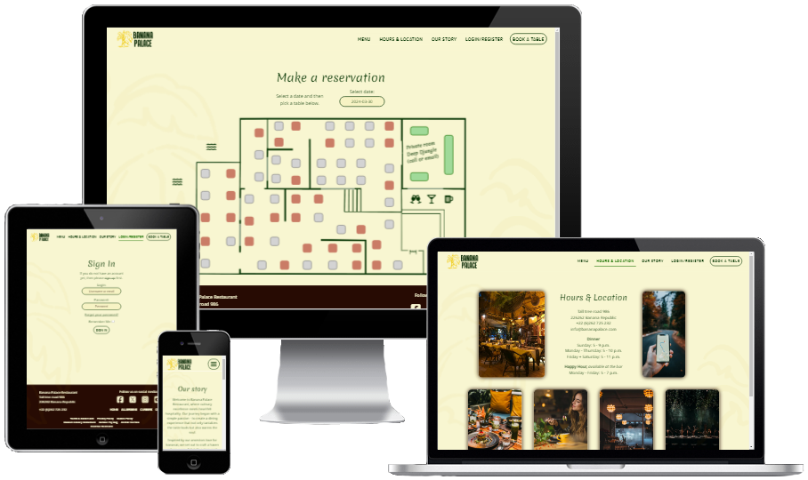

#  Banana Palace restaurant

Link to live website: [Banana Palace](https://banana-palace-9ad263ab8cf3.herokuapp.com/)  (*Hold Ctrl (or Cmd) and click to open in a new window.*)

## Table of contents

* [Automatic testing](#automatic-testing)
    * [Code validators](#code-validators)
    * [Lighthouse testing](#lighthouse-testing)
        * [Improvements](#improvements)
        * [Left to improve](#left-to-improve)
    * [Wave](#wave-testing)
        * [Improvements](#improvements-1)
        * [Left to improve](#left-to-improve-1)
* [Manual testing](#manual-testing)
    * [User story testing](#user-story-testing)
    * [Features](#features)
    * [Browser](#browser)
    * [Devices](#devices)
* [Bugs](#bugs)
    * [Solved bugs](#solved-bugs)
    * [Unfixed bugs](#unfixed-bugs)

## Automatic testing

### Code validators

**HTML** validated through [W3C Markup Validation Service](https://validator.w3.org/#validate_by_input). Some errors related to automatically created Django forms has been found but all custom written code passes the tests.
 

**CSS** validated through [W3C CSS Validation Service](https://jigsaw.w3.org/css-validator/validator) and returns 1 error and 22 warnings.
 

Validator is not able to parse this CSS selector because it checks for CSS level 3 and this selector uses modern CSS level 4 which has not yet been implemented. The warnings are due to the use of CSS variables, also ignored as it works as intended.

These are ignored because this CSS targetting works as intended in all browser testing.

TODO: Update after browser testing if problems occur

**JavaScript** checked with [JSHint](https://jshint.com/) to test for errors and potential problems. 
Script files has no warnings or errors.
 (*Uses ES6 features and jQuery which needs to be enabled in the configuration*).

- **Python**
All code validated through [PEP8 validator](https://pep8ci.herokuapp.com/) and TODO

### Lighthouse testing

Used lighthouse to test performance, accessibility, best practices, and search engine optimization of the website.

Result after optimization

#### Improvements
-
-

#### Left to improve
-
-

### Wave testing

TODO

#### Improvements
-
-

#### Left to improve
-
-

[Back to top](#table-of-contents)

## Manual testing

### User story testing

| User story | How are they achived |
| --- | --- |
| **EPIC Create website** |
| #6 As an owner I want to have website so that our restaurant has a stronger online presence and can attract more customers | To enhance the online presence of the restaurant and attract a wider customer base, I set out to design and implement a user-friendly website. Understanding the importance of a strong digital footprint, I embarked on a comprehensive process that began with thorough research into our business requirements and target audience preferences. |
| #7 As an owner I want to show our contact details so that customers can contact us for queries | To ensure easy access for customers seeking to contact us, I strategically placed our contact details in multiple prominent locations across the website. By integrating this information seamlessly into the design, I guarantee that visitors can quickly locate our contact information whenever they have inquiries or feedback.  |
| #8 As an owner I want display our address so that customer can find our location easily | To facilitate customers in finding our location effortlessly, these were also incorporated into various prominent sections. This enhances the user experience and enables visitors to locate our establishment with ease.
| #9 As an owner I want it to be easy to find the website on search engines so that anyone can find us and we get more business | To enhance the website's visibility on search engines and attract more potential customers, I focused on optimizing its search engine ranking. Implementing an effective SEO strategy, meta tags were added to all pages and employed semantic HTML techniques. |
| #10 As an owner I want to make sure the website is a good user experience so that customers enjoy their visit and wants to return | By implementing clear navigation pathways, I ensured that users can easily explore the site and find the information they need. Additionally, visual feedback mechanisms were incorporated to confirm users' actions, enhancing their interaction with the website. |
| #31 As an owner I want to have an about page so that so that customers can learn about our restaurant | To meet the owner's request for an about page that provides customers with insights into the restaurant, two distinct pages were added. The first page offers essential details such as contact information, location, and operating hours, ensuring easy access to key information for visitors. The second page delves into the restaurant's unique story, origin, and inspiration, providing a deeper understanding of its background and values.  |
| #32 As an owner I want to have custom error pages so that so that customers do not leave our website if an error occurs | To prevent customer departures during errors, we've added custom error pages (400, 403, 404, 500) with consistent design, including header and footer. These pages also feature a prominent button for quick return to the homepage. |
| #42 As an owner I want to show images of our menu items in a stylish way so that customers will get peckish when they visit the website | To entice customers and stimulate their appetite upon visiting the website, images of signature dishes have been incorporated into a sleek carousel on the landing page. |
| #11 As a user I want to visit the restaurants website so that I can see if I am interested in going there | To cater to users' desire to explore the restaurant's offerings and gauge their interest in visiting, the website has been designed with a focus on intuitive navigation and captivating content. By prioritizing ease of use and implementing engaging elements, such as vivid imagery and fun features, the website aims to pique users' curiosity and encourage them to consider a visit to the restaurant. |
| #12 As a user I want the website to have a familiar design so that it is intuitive for me to navigate and it is easy to use | To ensure a seamless user experience, the website's design was crafted with familiarity in mind. Drawing inspiration from established conventions in restaurant website layouts, extensive research was conducted to identify common practices.  |
| **EPIC Sign in feature** |
| #15 As an owner I want users to be able to delete their account and information so that we are in compliance with GDPR regulations | To align with GDPR regulations full CRUD functionality has been implemented for user accounts. This enables users to easily manage their personal information, including the option to delete their account and associated data as desired. |
| #16 As an owner I want to be able to give some user accounts special discounts so that my friends and family can get better price directly when booking online | To facilitate the owner's ability to offer special discounts to selected user accounts, the application has been configured to grant the owner exclusive permissions accessible from both the frontend and backend. |
| #40 As an owner I want to be able to see a list of all current users so that I can find their information and grant some people special "friends and family" discount | To fulfill the owner's request for visibility into all current users and the ability to grant special "friends and family" discount, a custom account page has been added specifically for the owner's access. This dedicated page allows the owner to conveniently view information about all users and easily select individuals to receive the a special discount. |
| #17 As a user I want to be able to sign in with password so that my account is secure | To ensure user account security, the system has been equipped with password-protected sign-in functionality. Users can create accounts secured by passwords, with their information stored using industry-standard encryption methods.  |
| #19 As a user I want to be able to update my personal information so that it can always be accurate when I make my bookings | To enable users to maintain accurate personal information for their bookings, an edit button has been added to the account page. This feature empowers users to conveniently update their account details, ensuring that their information remains current and relevant |
| #20 As a user I want to be able to delete my account so that so that I can keep my personal information secure by not sharing it anymore| To empower users to maintain control over their personal information and ensure their privacy, full CRUD (Create, Read, Update, Delete) permissions have been granted on their own accounts. This enables users to easily delete their accounts if they wish, thereby discontinuing the sharing of their personal information and enhancing their data security. By providing this level of autonomy, the system prioritizes user privacy and trust. |
| #21 As a user I want to be able to reset my password so that I can access my account even if I forget my password | To facilitate seamless access to user accounts, an option to reset passwords has been enabled. This functionality allows users to easily regain access to their accounts in the event of forgotten passwords, ensuring uninterrupted use of the platform. |
| **EPIC Reserve a table** |
| #22 As an owner I want users to be able to book a table online so that it reduces our administration costs for handling bookings | To streamline the booking process and reduce administration costs associated with handling reservations, a reservation page has been added to the website. This page allows users to conveniently book a table for a specified date and time without the need to contact the restaurant directly. |
| #23 As an owner I want to be able to see all current bookings so that we can plan ahead regarding space, table placements and purchasing raw materials | To facilitate effective planning for space, table placements, and purchasing of raw materials, a feature has been implemented allowing restaurant staff members to access all current bookings. This functionality is integrated into the reservation page, presenting a list of reservations for the selected date exclusively to authorized staff members. |
| #24 As a user I want to be able to book a table online so that booking will be easier and faster than with phone or email | To enhance the booking experience for users, an online reservation feature has been implemented with a focus on being fun, fast, and user-friendly. This feature enables users to easily book tables online, offering a seamless and efficient alternative to traditional phone or email reservations. |
| #25 As a user I want to be able to see all my bookings so that I can be reminded of when I made the reservations for | To facilitate users in keeping track of their reservations, all current bookings are now conveniently displayed on the account page. This feature ensures that users can easily access and review their reservations, providing a helpful reminder of when the bookings were made. |
| #26 As a user I want to be able to edit my current bookings so that I can I can have flexibility incase my schedule changes | To accommodate users' changing schedules and provide flexibility, an edit button has been added along with functionality allowing users to modify their reservations. This feature empowers users to easily adjust booking details as needed, ensuring that their reservations align with their updated schedules. |
| #27 As a user I want to be able to delete my booking so that I can let the restaurant know in advance that I changed my mind and want to cancel | To accommodate users who need to cancel their reservations, a delete button has been incorporated along with functionality allowing users to delete their bookings. To prevent accidental deletions, defensive design measures have been implemented. |
| **EPIC Menu** |
| #29 As an owner I want to show our current menu online so that we can attract customers and increace efficiency by reducing the time it takes users to decide what to eat | To showcase our offerings and improve efficiency in decision-making for users, a dedicated menu page has been added. This page displays all current menu items, allowing customers to easily browse and select their preferred dishes. |
| #30 As an owner I want be able to edit our menu online so that it is easy to keep it current and updated | To ensure the menu remains current and updated, restaurant staff members have been enabled to add new menu items and edit existing ones online. Additionally, the owner has been granted full CRUD permissions over menu items, allowing for seamless management and updates. |
| #41 As a user I want to look at the restaurants menu so that I can see if I am interested in going there | To assist users in evaluating their interest in visiting the restaurant, the website now features a dedicated menu section. Additionally, pictures of signature dishes have been added to the landing page, providing users with a visual preview of the restaurant's offerings. |

### Features

| Feature tested | Expected outcome | Testing Performed | Result | Pass / fail |
| --- | --- | --- | --- | --- |
| **Header / navigation bar** |
| Logo | Clicking takes the user to the home page | Clicked logo |  |  |
| Menu | Clicking takes the user to the menu page | Clicked  link |  |  |
| Hours & Location | Clicking takes the user to the about page | Clicked  link |  |  |
| Out story | Clicking takes the user to the story page | Clicked  link |  |  |
| Login/register | Clicking takes the user to the sign in page | Clicked link |  |  |
| Account/logout | Clicking takes the user to the account page | Clicked  link |  |  |
| Book a table | Clicking takes the user to the reservation page | Clicked  button |  |  |
| **Index page** |
| Scrolltop down | Scrolling down from top of index page shows smooth animation and change positions of navbar, logo and removes address and phone number | Scroll down |  |  |
| Scrolltop up | Scrolling up to top of index page shows smooth animation and reverts back to initial view | Scroll down |  |  |
| Carousel right | Clicking on right button shows the next menu item that is to the right of the current view | Click on right button |  |  |
| Carousel left | Clicking on left button shows the next menu item that is to the left of the current view | Click on left button |  |  |
| **Footer / Social media icons** |
| Facebook | Clicking opens Facebook in a separate tab | Clicked link |  |  |
| Twitter | Clicking opens Twitter in a separate tab | Clicked link |  |  |
| Instagram | Clicking opens Instagram in a separate tab | Clicked link |  |  |
| YouTube | Clicking opens YouTube in a separate tab | Clicked link |  |  |
| Feature |  |  |  |  |
| **Footer / company information links** |
| Home | Clicking takes the user to the home page  | Clicked link |  |  |
| Allergens | Clicking takes the user to the allergens page | Clicked link |  |  |
| Careers | Clicking takes the user to the careers page | Clicked link |  |  |
| Contact | Clicking takes the user to the about page | Clicked link |  |  |
| Terms & Conditions | Clicking takes the user to the terms & conditions page | Clicked link |  |  |
| Privacy Policy | Clicking takes the user to the Privacy Policy page | Clicked link |  |  |
| Cookie Policy | Clicking takes the user to the Cookie Policy page | Clicked link |  |  |
| Modern Slavery Statement | Clicking takes the user to the Modern Slavery Statement page | Clicked link |  |  |
| Gender Pay Gap | Clicking takes the user to the Gender Pay Gap page | Clicked link |  |  |
| Animal Welfare | Clicking takes the user to the Animal Welfare page | Clicked link |  |  |
| Investor Relations | Clicking takes the user to the Investor Relations page | Clicked link |  |  |
| **Menu** |
| Feature |  |  |  |  |
| Feature |  |  |  |  |
| **Account management** |
| Sign up  | Able to sign up to website | Enter required information |  |  |
| Verify email address  | When clicking on verification link in email, should be directed to page and email verified | Click on email link |  |  |
| Reset password | Able to reset password if needed |  |  |  |
| Sign in | Able to log in and redirected to account page |  |  |  |
| Edit account | Can change personal details on the account |  |  |  |
| Change password | Able to change the password on the account |  |  |  |
| Delete account | Can delete account and personal information |  |  |  |
| CSS validation error | Can see the CSS as intended even though validator flags it as error | Look at affected areas |  |  |
| CSS validation warnings | All styles with CSS variables looks as intended |  |  |  |
| **Make reservation** |
| View menu |  |  |  |  |
| Edit menu item |  |  |  |  |
| Delete menu item |  |  |  |  |
| Terms & Conditions | Clicking takes the user to the terms & conditions page | Clicked link |  |  |
| Previous page | Clicking takes the user to the terms & conditions page | Clicked link |  |  |
| **Hover effects** |
| Header links |  |  |  |  |
| Header logo |  |  |  |  |
| Buttons |  |  |  |  |
| Input fields |  |  |  |  |
| Tables |  |  |  |  |
| Footer |  |  |  |  |
| **Form validation** |
| Enter valid information |  |  |  |  |
| Enter invalid information |  |  |  |  |
| Leave fields empty |  |  |  |  |
| Enter blank spaces |  |  |  |  |
| **Security** |
| Change another users account details |  |  |  |  |
| Delete another users account |  |  |  |  |
| Change another users reservation details |  |  |  |  |
| Delete another users reservation |  |  |  |  |
| Change a menu item without permission |  |  |  |  |
| Delete a menu item without permission |  |  |  |  |

### Browser
Each website [feature](#features) has been tested on Google Chrome, Microsoft Edge, Firefox, and Samsung Internet Browser.

| Feature tested \  On browser | Google Chrome | Microsoft Edge | Firefox | Samsung Internet  |
| --- | --- | --- | --- | --- |
| Works as intended |  |  |  |  |

Note: Hover effects were not tested on Samsung internet because a tablet was used.

### Devices
Manually tested on mobile device (Xiaomi 12), tablet (Samsung Galaxy tab S4) laptop, and desktop computer.

| Devices | Expected outcome / responsive | Pass / fail |
| --- | --- | --- |
| Mobile (Xiaomi 12) | Looks as intended on this small screen size |  |
| Tablet (Galaxy tab S4) | Looks as intended on this screen size |  |
| Laptop (1366x768px) | Looks as intended on medium size screen |  |
| Desktop (1920x1080px) | Looks as intended on big size screen |  |

Notes:
All testing was made on up-to-date browsers.
The desktop computer also tested with Chrome developer tools from 280px wide screen up to 2560px.

Note: Datepicker on reservation does not look good on Galaxy fold (unfolded) 280px width. Problem ignored since it is functional on Galaxy fold with a sideways scrollbar and that model can be opened to be viewed larger. Problem does not exist on screenwidth 300px and above.

## Bugs

### Solved bugs

A large number of bugs was accidentally created during development and had to be fixed.
Fixes included:
- looking through code line by line
- using print() and console.log() statements to see what was acctually going on
- review commit history
- search google for possible solutions
- a lot of trial and error

Noteworthy bugs are added as [issues](https://github.com/NiclO1337/pp4-banana-palace/issues?q=is%3Aopen+is%3Aissue+label%3Abug) on GitHub and placed on the Kanban board as high priority.

### Unfixed bugs

Bugs that remain after project deadline for release are currently labelled as [wont-fix-yet](https://github.com/NiclO1337/pp4-banana-palace/issues?q=is%3Aopen+is%3Aissue+label%3A%22wont+fix+yet%22) on GitHub issues page.