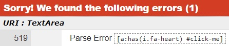

#  Banana Palace restaurant

Link to live website: [Banana Palace](https://banana-palace-9ad263ab8cf3.herokuapp.com/)  (*Hold Ctrl (or Cmd) and click to open in a new window.*)

## Table of contents

* [Automatic testing](#automatic-testing)
    * [Code validators](#code-validators)
    * [Lighthouse testing](#lighthouse-testing)
        * [Improvements](#improvements)
        * [Left to improve](#left-to-improve)
    * [Wave](#wave-testing)
        * [Improvements](#improvements-1)
        * [Left to improve](#left-to-improve-1)
* [Manual testing](#manual-testing)
    * [Website goals](#website-goals)
    * [User goals](#user-goals)
    * [Features](#features)
    * [Browser](#browser)
    * [Devices](#devices)
* [Bugs](#bugs)
    * [Solved bugs](#solved-bugs)
    * [Unfixed bugs](#unfixed-bugs)

## Automatic testing

### Code validators

- **HTML**
Validated through [W3C Markup Validation Service](https://validator.w3.org/#validate_by_input). Some errors related to automatically created Django forms has been found but all custom written code passes the tests.
 

- **CSS**
Validated through [W3C CSS Validation Service](https://jigsaw.w3.org/css-validator/validator) and returns 1 error and 22 warnings.
 

#### Error
Validator is not able to parse this CSS because it checks for CSS level 3 and this selector uses modern CSS level 4 which has not yet been implemented. The error is ignored because this CSS targetting works as intended in all browser testing.

TODO: Update after browser testing

#### Warnings are due to the use of CSS variables, also ignored as it works as intended.

- **JavaScript**
checked with [JSHint](https://jshint.com/) to test for errors and potential problems. 
Code has TODO
 (*Uses ES6 features which needs to be enabled in the configuration*).

- **Python**
All code validated through [PEP8 validator](https://pep8ci.herokuapp.com/) and TODO

### Lighthouse testing

Used lighthouse to test performance, accessibility, best practices, and search engine optimization of the website.

Result after optimization

#### Improvements
-
-

#### Left to improve
-
-

### Wave testing

TODO

#### Improvements
-
-

#### Left to improve
-
-

[Back to top](#table-of-contents)

## Manual testing

### Website goals

| Owners user stories | How are they achived |
| --- | --- |
| **EPIC** |
| User story |  |
| User story |  |
| User story |  |
| **EPIC** |
| User story |  |
| User story |  |
| User story |  |

### User goals

| User stories | How are they achived |
| --- | --- |
| **EPIC** |
| User story |  |
| User story |  |
| User story |  |
| **EPIC** |
| User story |  |
| User story |  |
| User story |  |

### Features

| Feature tested | Expected outcome | Testing Performed | Result | Pass / fail |
| --- | --- | --- | --- | --- |
| **Header / navigation bar** |
| Feature |  |  |  |  |
| Feature |  |  |  |  |
| **Footer / Social media icons** |
| Feature |  |  |  |  |
| Feature |  |  |  |  |
| **Account management** |
| Feature |  |  |  |  |
| Feature |  |  |  |  |
| **Make reservation** |
| Feature |  |  |  |  |
| Feature |  |  |  |  |
| **Menu** |
| Feature |  |  |  |  |
| Feature |  |  |  |  |
| **Reviews** |
| Feature |  |  |  |  |
| Feature |  |  |  |  |
| **Hover effects** |
| Feature |  |  |  |  |
| Feature |  |  |  |  |

### Browser
Each website [feature](#features) has been tested on Google Chrome, Microsoft Edge, Firefox, and Samsung Internet Browser.

| Feature tested \  On browser | Google Chrome | Microsoft Edge | Firefox | Samsung Internet  |
| --- | --- | --- | --- | --- |
| Works as intended |  |  |  |  |

### Devices
Manually tested on mobile device (Xiaomi 12), tablet (Samsung Galaxy tab S4) laptop, and desktop computer.

| Devices | Expected outcome / responsive | Pass / fail |
| --- | --- | --- |
| Mobile (Xiaomi 12) | Looks as intended on this small screen size |  |
| Tablet (Galaxy tab S4) | Looks as intended on this screen size |  |
| Laptop (1366x768px) | Looks as intended on medium size screen |  |
| Desktop (1920x1080px) | Looks as intended on big size screen |  |

Notes:
All testing was made on up-to-date browsers.
The desktop computer also tested with Chrome developer tools from 280px wide screen up to 2560px.

Note: Datepicker on reservation does not look good on Galaxy fold (unfolded) 280px width. Problem ignored since it is functional on Galaxy fold with a sideways scrollbar and that model can be opened to view bigger. Problem does not exist on screenwidth 300px and above.

## Bugs

### Solved bugs

A large number of bugs was accidentally created during development and had to be fixed.
Fixes included:
- looking through code line by line
- using print() and console.log() statements to see what was acctually going on
- review commit history
- search google for possible solutions
- a lot of trial and error

Noteworthy bugs are added as [issues](https://github.com/NiclO1337/pp4-banana-palace/issues?q=is%3Aopen+is%3Aissue+label%3Abug) on GitHub and placed on the Kanban board as high priority.

### Unfixed bugs

Bugs that remain after project deadline for release are currently labelled as [wont-fix-yet](https://github.com/NiclO1337/pp4-banana-palace/issues?q=is%3Aopen+is%3Aissue+label%3A%22wont+fix+yet%22) on GitHub issues page.