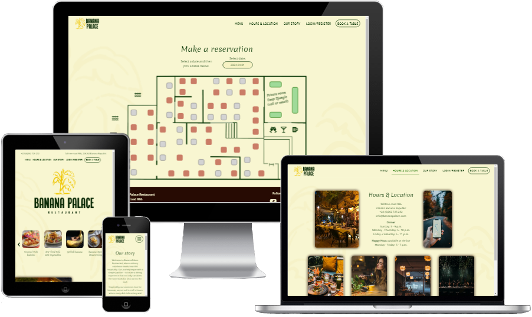

#  Banana Palace restaurant

Link to live website: [Banana Palace](https://banana-palace-9ad263ab8cf3.herokuapp.com/)  (*Hold Ctrl (or Cmd) and click to open in a new window.*)

## Table of contents

* [Automatic testing](#automatic-testing)
    * [Code validators](#code-validators)
    * [Lighthouse testing](#lighthouse-testing)
        * [Improvements](#improvements)
        * [Left to improve](#left-to-improve)
    * [Wave](#wave-testing)
        * [Improvements](#improvements-1)
        * [Left to improve](#left-to-improve-1)
* [Manual testing](#manual-testing)
    * [Website goals](#website-goals)
    * [User goals](#user-goals)
    * [Features](#features)
    * [Browser](#browser)
    * [Devices](#devices)
* [Bugs](#bugs)
    * [Solved bugs](#solved-bugs)
    * [Unfixed bugs](#unfixed-bugs)

## Automatic testing

### Code validators

**HTML** validated through [W3C Markup Validation Service](https://validator.w3.org/#validate_by_input). Some errors related to automatically created Django forms has been found but all custom written code passes the tests.
 

**CSS** validated through [W3C CSS Validation Service](https://jigsaw.w3.org/css-validator/validator) and returns 1 error and 22 warnings.
 

Validator is not able to parse this CSS selector because it checks for CSS level 3 and this selector uses modern CSS level 4 which has not yet been implemented. The warnings are due to the use of CSS variables, also ignored as it works as intended.

These are ignored because this CSS targetting works as intended in all browser testing.

TODO: Update after browser testing if problems occur

**JavaScript** checked with [JSHint](https://jshint.com/) to test for errors and potential problems. 
Script files has no warnings or errors.
 (*Uses ES6 features and jQuery which needs to be enabled in the configuration*).

- **Python**
All code validated through [PEP8 validator](https://pep8ci.herokuapp.com/) and TODO

### Lighthouse testing

Used lighthouse to test performance, accessibility, best practices, and search engine optimization of the website.

Result after optimization

#### Improvements
-
-

#### Left to improve
-
-

### Wave testing

TODO

#### Improvements
-
-

#### Left to improve
-
-

[Back to top](#table-of-contents)

## Manual testing

### Website goals

| Owners user stories | How are they achived |
| --- | --- |
| **EPIC Create website** |
| #6 As a owner I want to have website so that our restaurant has a stronger online presence and can attract more customers | Design and implement a website that fits the needs of the business |
| #7 As a owner I want to show our contact details so that customers can contact us for queries | Contact details added to multiple places throughout the website so that they are always easy to find |
| #8 As a owner I want display our address so that customer can find our location easily | Add restaurant address to multiple places on the site so that it can be found easily |
| #9 As a owner I want it to be easy to find the website on search engines so that anyone can find us and we get more business | Add meta tags to all pages and use semantic HTML for better SEO rating |
| #10 As a owner I want to make sure the website is a good user experience so that customers enjoy their visit and wants to return | Make sure that it is easy and intuitive to navigate around the website. Visual feedback is given at all times to confirm users actions. |
| #31 As a owner I want to have an about page so that so that customers can learn about our restaurant | Add two pages about the restaurant. The first one with contact details, location and what times they are open. And the other one with their story, origin and inspiration. |
| #32 As a owner I want to have custom error pages so that so that customers do not leave our website if an error occurs | Error pages for common HTTP problems (400, 403, 404, 500) are added to the website |
| #42 As a owner I want to show images of our menu items in a stylish way so that customers will get peckish when they visit the website | Images of signature dishes are added to the landing page in a carousel that users can look through |
| **EPIC Sign in feature** |
| #15 As a owner I want users to be able to delete their account and information so that we are in compliance with GDPR regulations | Give all users full CRUD over their accounts and personal information |
| #16 As a owner I want to be able to give some user accounts special discounts so that my friends and family can get better price directly when booking online | Give owner special permissions on both frontend and backend of the application |
| #40 As a owner I want to be able to see a list of all current users so that I can find their information and grant some people special "friends and family" discount | Add a custom account page for owner so they are able to see all users and grant discounts to selected customers |
| **EPIC Reserve a table** |
| #22 As a owner I want users to be able to book a table online so that it reduces our administration costs for handling bookings | Add reservation page where users can book a table on specified date and time without contacting the restaurant |
| #23 As a owner I want it to be able to see all current bookings so that we can plan ahead regarding space, table placements and purchasing raw materials | On the reservation page, add a list of all current reservations for the selected date and only give restaurant staff members the permission to see them |
| **EPIC Menu** |
| #29 As a owner I want to show our current menu online so that we can attract customers and increace efficiency by reducing the time it takes users to decide what to eat | Add a menu page and display all current menu items |
| #30 As a owner I want be able to edit our menu online so that it is easy to keep it current and updated | Enable restaurant staff members to add menu items and edit current items. Grant owner full CRUD permission over menu items |

### User goals

| User stories | How are they achived |
| --- | --- |
| **EPIC Create website** |
| #11 As a user I want to visit the restaurants website so that I can see if I am interested in going there | Design a website that is easy to navigate and makes the customer curious about visiting |
| #12 As a user I want the website to have a familiar design so that it is intuitive for me to navigate and it is easy to use | Research restaurant websites to see how they are normally set up and make sure this project follows standard convention and is easy to use |
| **EPIC Sign in feature** |
| #17 As a user I want to be able to sign in with password so that my account is secure | Enable users to be able to create accounts that are protected by password and information stored utilizing industry-standard encryption methods |
| #19 As a user I want to be able to update my personal information so that it can always be accurate when I make my bookings | Add a edit button the the account page that allowes users to edit their own account details |
| #20 As a user I want to be able to delete my account so that so that I can keep my personal information secure by not sharing it anymore| Give users full CRUD permission on their own accounts |
| #21 As a user I want to be able to reset my password so that I can access my account even if I forget my password | Enable the option to reset password |
| **EPIC Reserve a table** |
| #24 As a user I want to be able to book a table online so that booking will be easier and faster than with phone or email | Implement a online reservation feature that is fun, fast, and easy to use |
| #25 As a user I want to be able to see all my bookings so that I can be reminded of when I made the reservations for | Display all current reservations on the account page  |
| #26 As a user I want to be able to edit my current bookings so that I can I can have flexibility incase my schedule changes | Add an edit button and create funcionality for users to be able to edit their reservations |
| #27 As a user I want to be able to delete my booking so that I can let the restaurant know in advance that I changed my mind and want to cancel | Add a delete button and create functionality to let users delete reservations, implement defensive design to prevent accidental deletions |
| **EPIC Menu** |
| #41 As a user I want to look at the restaurants menu so that I can see if I am interested in going there | Add menu to the website as well as pictures of signature dishes to the landing page |

### Features

| Feature tested | Expected outcome | Testing Performed | Result | Pass / fail |
| --- | --- | --- | --- | --- |
| **Header / navigation bar** |
| Logo | Clicking takes the user to the Home page | Clicked logo |  |  |
| Menu | Clicking takes the user to the Menu page | Clicked on link |  |  |
| Hours & Location | Clicking takes the user to the about page | Clicked on link |  |  |
| Out story | Clicking takes the user to the story page | Clicked on link |  |  |
| Login/register | Clicking takes the user to the sign in page | Clicked on link |  |  |
| Account/logout | Clicking takes the user to the account page | Clicked on link |  |  |
| Book a table | Clicking takes the user to the reservation page | Clicked on button |  |  |
| **Index page** |
| Scrolltop down | Scrolling down from top of index page shows smooth animation and change positions of navbar, logo and removes address and phone number | Scroll down |  |  |
| Scrolltop up | Scrolling up to top of index page shows smooth animation and reverts back to initial view | Scroll down |  |  |
| Carousel right | Clicking on right button shows the next menu item that is to the right of the current view | Click on right button |  |  |
| Carousel left | Clicking on left button shows the next menu item that is to the left of the current view | Click on left button |  |  |
| **Footer / Social media icons** |
| Feature |  |  |  |  |
| Feature |  |  |  |  |
| **Account management** |
| Feature |  |  |  |  |
| Feature |  |  |  |  |
| **Make reservation** |
| Feature |  |  |  |  |
| Feature |  |  |  |  |
| **Menu** |
| Feature |  |  |  |  |
| Feature |  |  |  |  |
| **Reviews** |
| Feature |  |  |  |  |
| Feature |  |  |  |  |
| **Hover effects** |
| Feature |  |  |  |  |
| Feature |  |  |  |  |

### Browser
Each website [feature](#features) has been tested on Google Chrome, Microsoft Edge, Firefox, and Samsung Internet Browser.

| Feature tested \  On browser | Google Chrome | Microsoft Edge | Firefox | Samsung Internet  |
| --- | --- | --- | --- | --- |
| Works as intended |  |  |  |  |

### Devices
Manually tested on mobile device (Xiaomi 12), tablet (Samsung Galaxy tab S4) laptop, and desktop computer.

| Devices | Expected outcome / responsive | Pass / fail |
| --- | --- | --- |
| Mobile (Xiaomi 12) | Looks as intended on this small screen size |  |
| Tablet (Galaxy tab S4) | Looks as intended on this screen size |  |
| Laptop (1366x768px) | Looks as intended on medium size screen |  |
| Desktop (1920x1080px) | Looks as intended on big size screen |  |

Notes:
All testing was made on up-to-date browsers.
The desktop computer also tested with Chrome developer tools from 280px wide screen up to 2560px.

Note: Datepicker on reservation does not look good on Galaxy fold (unfolded) 280px width. Problem ignored since it is functional on Galaxy fold with a sideways scrollbar and that model can be opened to view bigger. Problem does not exist on screenwidth 300px and above.

## Bugs

### Solved bugs

A large number of bugs was accidentally created during development and had to be fixed.
Fixes included:
- looking through code line by line
- using print() and console.log() statements to see what was acctually going on
- review commit history
- search google for possible solutions
- a lot of trial and error

Noteworthy bugs are added as [issues](https://github.com/NiclO1337/pp4-banana-palace/issues?q=is%3Aopen+is%3Aissue+label%3Abug) on GitHub and placed on the Kanban board as high priority.

### Unfixed bugs

Bugs that remain after project deadline for release are currently labelled as [wont-fix-yet](https://github.com/NiclO1337/pp4-banana-palace/issues?q=is%3Aopen+is%3Aissue+label%3A%22wont+fix+yet%22) on GitHub issues page.